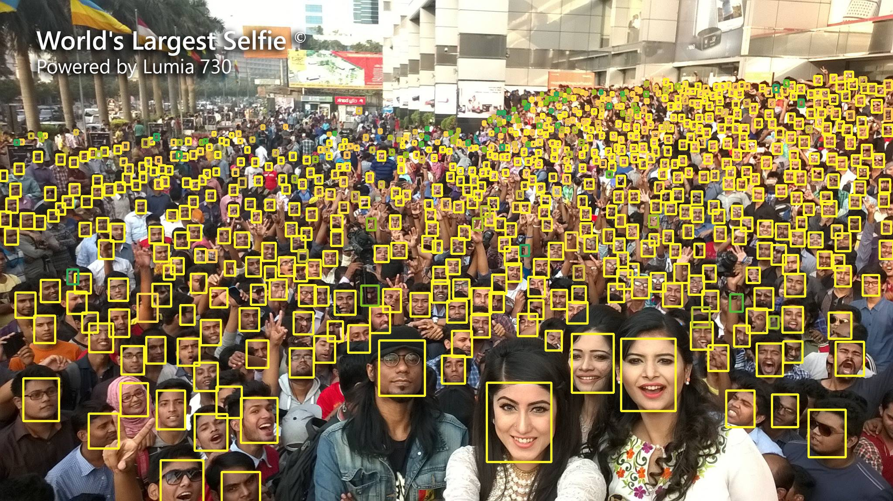
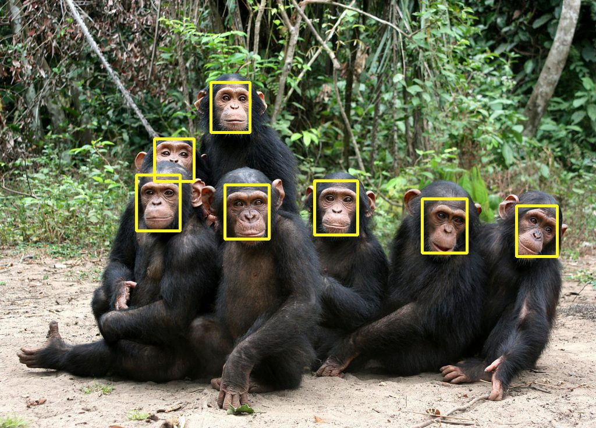
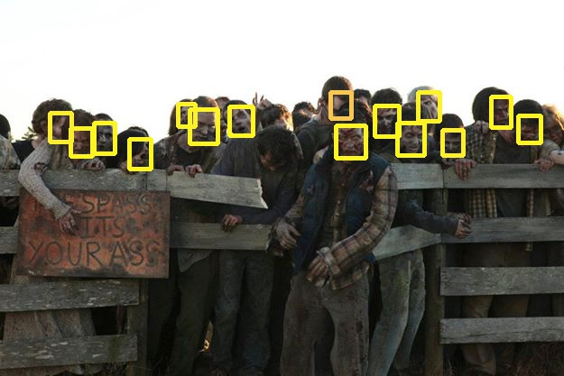

# Tiny-Faces-Dectector
A face detection model capable of detecting faces of various scales and sizes. This is trained using a Multi-Branch FCNN and modified Super Resolution GAN. Implementation of the paper [Finding Tiny Faces](https://arxiv.org/abs/1612.04402)

## Introduction
The paper - released at CVPR 2017 - deals with finding small objects (particularly faces in our case) in an image, 
based on scale-specific detectors by using features defined over single (deep) feature hierarchy : 
Scale Invariance, Image resolution, Contextual reasoning. The algorithm is based on foveal descriptors, i.e blurring the peripheral image to encode and give just enough information about the context, mimicking the human vision. The code present in this repo is an implementation of the model using TensorFlow and OpenCV2.

## Requirements

Codes are written in Python. First, install [Anaconda](https://docs.anaconda.com/anaconda/install.html).
Then install [OpenCV](https://github.com/opencv/opencv), [TensorFlow](https://www.tensorflow.org/).

## Usage

### Converting a pretrained model

`matconvnet_hr101_to_pickle` reads weights of the MatConvNet pretrained model and 
write back to a pickle file which is used in a TensorFlow model as initial weights.

1. Download a [ResNet101-based pretrained model(hr_res101.mat)](https://www.cs.cmu.edu/%7Epeiyunh/tiny/hr_res101.mat) 
from the authors' repo.

2. Convert the model to a pickle file by:
```
python matconvnet_hr101_to_pickle.py 
        --matlab_model_path /path/to/pretrained_model 
        --weight_file_path  /path/to/pickle_file
```

### Testing Tiny Face Detector in TensorFlow

1. Prepare images in a directory. 

2. `main.py` reads the test image from the image directory and 
output the result image.
To change the input test images, go to main.py and change line 15

```
img = cv2.imread('test.jpeg')
```

Here test.jpeg is the input test image


## Neural network diagram

[This](https://github.com/hash283/Tiny-Faces-Dectector/blob/master/ResNet101.pdf)(pdf) is 
a network diagram of the ResNet101-based model used here for an input image(height: 1150, width: 2048, channel: 3).

## Results




